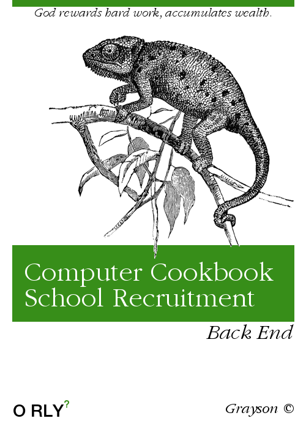

The author started preparing for the internship in March this year. During the preparation process, I learned a lot from the open source community. For example, I learned about the blogs of many big guys ([Halfrost's Field | Frost Land](https://halfrost.com)) and built my own knowledge base ([Grayson's Notebook](https://notebook.grayson.top)). Therefore, I want to precipitate this knowledge and give back to the community. On the one hand, I can not only deepen my understanding of this knowledge, on the other hand, I can also communicate and learn with other friends and make progress together.
If there is something missing from the article in the book, or you have a better answer or question, please click the edit button at the bottom of the page to comment and interact, or get in touch with the author through i@grayson.top, thank you for your support and help.